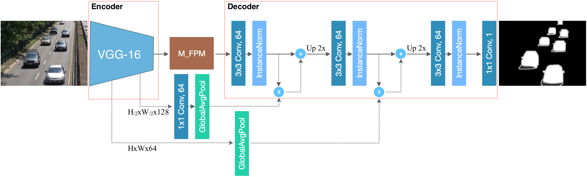

# FgSegNet_v2 : Foreground Segmentation Network version 2

This repository contains source codes and training sets for the following paper:<br /><br />
***["Learning Multi-scale Features for Foreground Segmentation."](https://arxiv.org/abs/1808.01477) by Long Ang LIM and Hacer YALIM KELES*** <br /><br />
The preprint version is available at: https://arxiv.org/abs/1808.01477 <br/><br/>


<br/>

## Citation
If you find FgSegNet_v2 useful in your research, please consider citing: <br />

```
@article{lim2018learning,
	  title={Learning Multi-scale Features for Foreground Segmentation},
	  author={Lim, Long Ang and Keles, Hacer Yalim},
	  journal={arXiv preprint arXiv:1808.01477},
	  year={2018}
}
```

## Requirements
This work was implemented with the following frameworks:
* Spyder 3.2.x (recommended)
* Python 3.6.3
* Keras 2.0.6
* Tensorflow-gpu 1.1.0

## Usage
1. Clone this repo: ```git clone https://github.com/lim-anggun/FgSegNet_v2.git```

2. Download [CDnet2014](http://changedetection.net), [SBI2015](https://github.com/lim-anggun/FgSegNet) and [UCSD](https://github.com/lim-anggun/FgSegNet) datasets, then put them in the following directory structure:<br/>

    Example:

    ```
     FgSegNet_v2/
          scripts/FgSegNet_v2_CDnet.py
                 /FgSegNet_v2_SBI.py
                 /FgSegNet_v2_UCSD.py
                 /FgSegNet_v2_module.py
                 /instance_normalization.py
                 /my_upsampling_2d.py
          datasets/
                  /CDnet2014_dataset/...
                  /SBI2015_dataset/...
                  /UCSD_dataset/...
          training_sets/
                       /CDnet2014_train/...
                       /SBI2015_train/...
                       /UCSD_train20/...
                       /UCSD_train50/...
    ```

3. Run the codes with **Spyder IDE**. Note that all trained models will be automatically saved (in current working directory) for you.

## Evaluation
We evaluate our method using three different datasets as described in [here](https://github.com/lim-anggun/FgSegNet) or [here](http://www.sciencedirect.com/science/article/pii/S0167865518303702).

## Results
### Results on CDnet2014 dataset
Table below shows overall results across 11 categories obtained from [Change Detection 2014 Challenge](http://changedetection.net).

| Methods  | PWC | F-Measure | Speed (320x240, batch-size=1) on NVIDIA GTX 970 GPU |
| ------------- | ------------- | ------------- | ------------- |
| FgSegNet_v2  | 0.0402 | 0.9847 | 23fps |

### Results on SBI2015 dataset
Table below shows overall *test results* across 14 video sequences.

| Methods  | PWC | F-Measure |
| ------------- | ------------- | ------------- |
| FgSegNet_v2  | 0.7148 | 0.9853 |

### Results on UCSD Background Subtraction dataset
Table below shows overall *test results* across 18 video sequences.

| Methods  | PWC (20% split) | F-Measure (20% split) | PWC (50% split) | F-Measure (50% split) |
| ------------- | ------------- | ------------- | ------------- | ------------- |
| FgSegNet_v2  | 0.6136 | 0.8945 | 0.4405 | 0.9203 |

## Updates
**07/08/2018:**
- add FgSegNet_v2 source codes and training frames

## Contact
lim.longang at gmail.com <br/>
Any issues/discussions are welcome.
