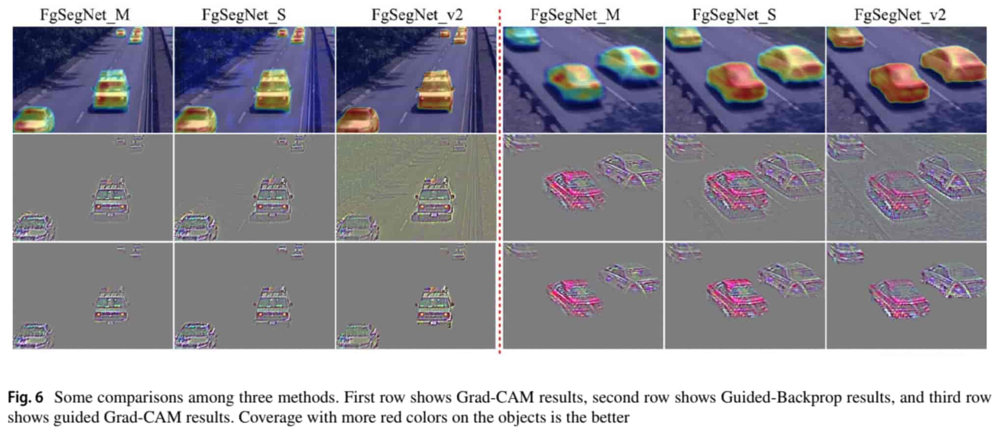

# FgSegNet_v2 : Foreground Segmentation Network version 2

This repository contains source codes and training sets for the following paper:<br /><br />
***["Learning multi-scale features for foreground segmentation."](https://doi.org/10.1007/s10044-019-00845-9) by Long Ang LIM and Hacer YALIM KELES*** <br /><br />

- #### Published at [Pattern Analysis and Applications](https://doi.org/10.1007/s10044-019-00845-9)

- The preprint version is available at: https://arxiv.org/abs/1808.01477 <br/><br/>


<br/>
<br/>


<br/>
<br/>


## Citation
If you find FgSegNet_v2 useful in your research, please consider citing: <br />

```
Lim, L.A. & Keles, H.Y. Pattern Anal Applic (2019). https://doi.org/10.1007/s10044-019-00845-9
```

Preprint:
```
@article{lim2018learning,
	  title={Learning Multi-scale Features for Foreground Segmentation},
	  author={Lim, Long Ang and Keles, Hacer Yalim},
	  journal={arXiv preprint arXiv:1808.01477},
	  year={2018}
}
```

## Requirements
This work was implemented with the following frameworks:
* Spyder 3.2.x (recommended)
* Python 3.6.3
* Keras 2.0.6
* Tensorflow-gpu 1.1.0

## Usage
1. Clone this repo: ```git clone https://github.com/lim-anggun/FgSegNet_v2.git```

2. Download [CDnet2014](http://changedetection.net), [SBI2015](https://github.com/lim-anggun/FgSegNet) and [UCSD](https://github.com/lim-anggun/FgSegNet) datasets, then put them in the following directory structure:<br/>

    Example:

    ```
     FgSegNet_v2/
          scripts/FgSegNet_v2_CDnet.py
                 /FgSegNet_v2_SBI.py
                 /FgSegNet_v2_UCSD.py
                 /FgSegNet_v2_module.py
                 /instance_normalization.py
                 /my_upsampling_2d.py
		     /prediction_example.ipynb
		     
          datasets/
                  /CDnet2014_dataset/...
                  /SBI2015_dataset/...
                  /UCSD_dataset/...
		  
          training_sets/
                       /CDnet2014_train/...
                       /SBI2015_train/...
                       /UCSD_train20/...
                       /UCSD_train50/...
		       
	  testing_scripts/extract_mask.py
	  		 /thresholding.py
			 /python_metrics/...
    ```

3. Run the codes with **Spyder IDE**. Note that all trained models will be automatically saved (in current working directory) for you.

4. Here is how to extract foreground masks. Suppose your files are stored in the following dir structures:

```
     # Script file in the root dir
     extract_mask.py
     
     # Dataset downloaded from changedetection.net
     CDnet2014_dataset/baseline/...
     		      /cameraJitter/...
		      /badWeather/...
	
     # your trained model dir (models25 = models trained with 25 frames, (50frames, 200frames)
     FgSegNet_v2/models25/baseline/mdl_highway.h5
     				  /mdl_pedestrians.h5
				  ...
		         /cameraJitter/mdl_badminton.h5
			 	      /mdl_traffic.h5
				      /...
			/...
			 			
     
 ```
Go to Window cmd and run:


``` 
> python extract_mask.py 
```


> Your extracted frames will be automatically stored in ```FgSegNet_v2/results25/[CATEGORY_NAME]/[SCENE_NAME]/[binXXXXXX.png, ...]```

5. Threshold your foreground masks. Suppose that your extracted frames are stored in above folders. Go to cmd and run:

``` 
> python thresholding.py
```

> Your thresholded frames will be automatically stored in ```FgSegNet_v2/results25_th[0.X]/[CATEGORY_NAME]/[SCENE_NAME]/[binXXXXXX.png, ...]```


6. Remove training frames from your thresholded frames and evaluate your results.

## Evaluation
We evaluate our method using three different datasets as described in [here](https://github.com/lim-anggun/FgSegNet) or [here](http://www.sciencedirect.com/science/article/pii/S0167865518303702).

e.g.
``` 
> cd python_metrics
> python processFolder.py dataset_path root_path_of_thresholded_frames
```

## Results
### Results on CDnet2014 dataset
Table below shows overall results across 11 categories obtained from [Change Detection 2014 Challenge](http://changedetection.net).

| Methods  | PWC | F-Measure | Speed (320x240, batch-size=1) on NVIDIA GTX 970 GPU |
| ------------- | ------------- | ------------- | ------------- |
| FgSegNet_v2  | 0.0402 | 0.9847 | 23fps |

### Results on SBI2015 dataset
Table below shows overall *test results* across 14 video sequences.

| Methods  | PWC | F-Measure |
| ------------- | ------------- | ------------- |
| FgSegNet_v2  | 0.7148 | 0.9853 |

### Results on UCSD Background Subtraction dataset
Table below shows overall *test results* across 18 video sequences.

| Methods  | PWC (20% split) | F-Measure (20% split) | PWC (50% split) | F-Measure (50% split) |
| ------------- | ------------- | ------------- | ------------- | ------------- |
| FgSegNet_v2  | 0.6136 | 0.8945 | 0.4405 | 0.9203 |

### YouTube
<a href="http://www.youtube.com/watch?feature=player_embedded&v=5yc1JNHIa5o
" target="_blank"></a>


## Updates

**09/11/2019:**
- add testing scripts as requested

**07/08/2018:**
- add FgSegNet_v2 source codes and training frames

**04/02/2019:**
- add a jupyter notebook & a YouTube video
## Contact
lim.longang at gmail.com <br/>
Any issues/discussions are welcome.
